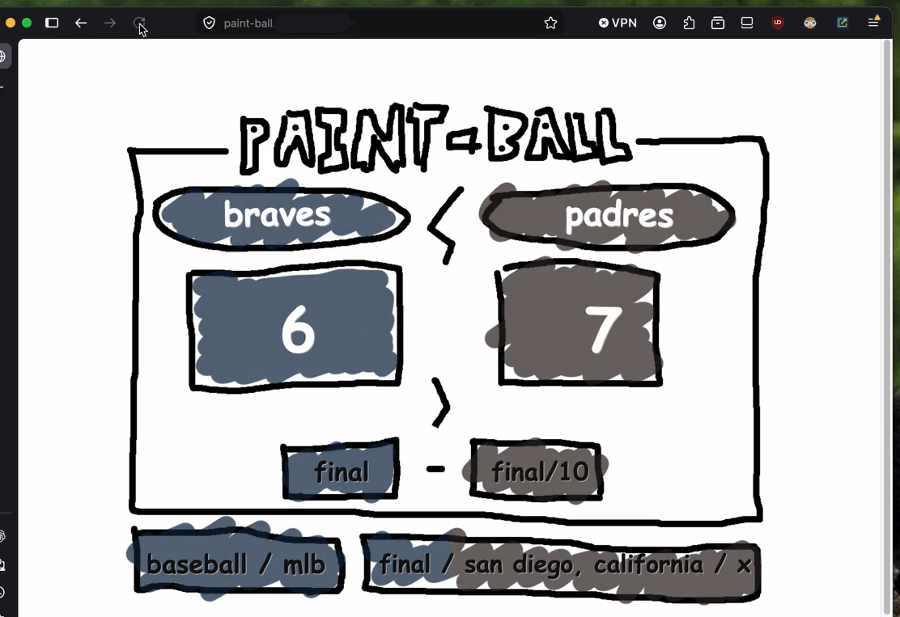

paint-ball-xl

same paint scoreboard idea, but xl tries to find one random live score from somewhere.

plain html/css/js.

it checks simple free score feeds, prefers live games, then finals from today, then scheduled stuff. if nothing usable shows up, it just leaves the board at x.

  

