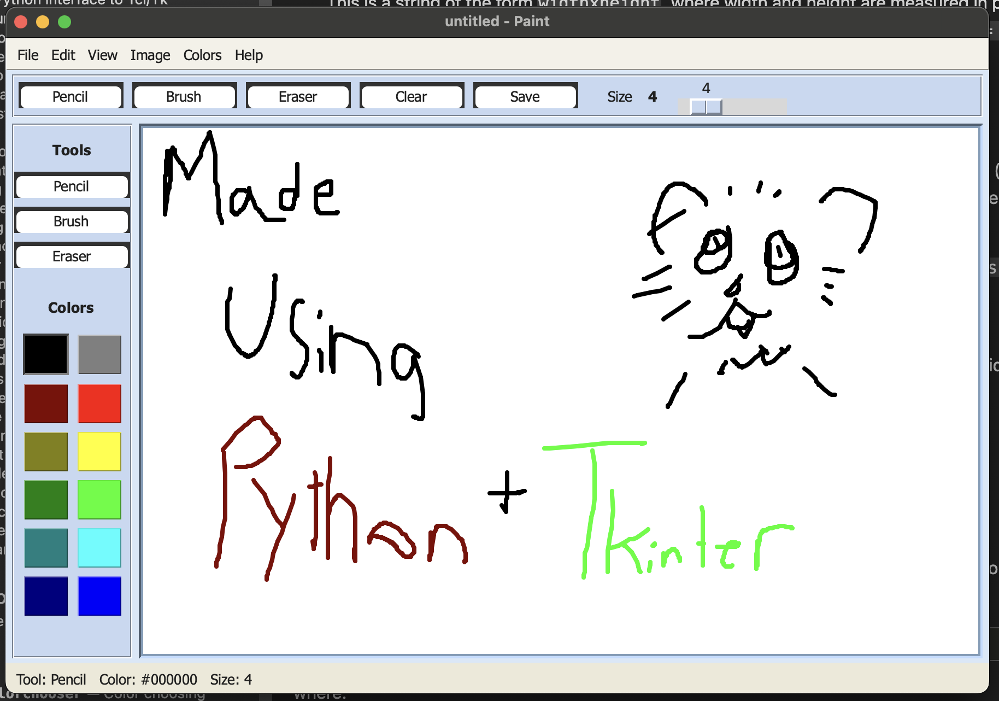

# pandadraw

a tiny paint-style app made with python and tkinter.

it is meant to look a little like old ms paint, but stay simple enough to read in one sitting.
i used it to learn tkinter too.



run it with:

```bash
python3 app.py
```

if macOS shows a python crash window, that is probably the xcode python build.
using python from python.org or homebrew should fix it.
